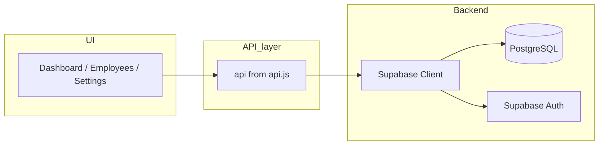

# Supabase backend: schema and API mapping

## 1. Current entity usage (no code changes)

The app uses a single `api` object from [src/api/api.js](src/api/api.js) with:

- **api.entities.Employee** – list, create, update, delete, bulkCreate  
- **api.entities.Shift** – list, create, update, delete, bulkCreate  
- **api.entities.TimeOff** – list, create, update, delete, bulkCreate  
- **api.entities.Event** – list, create, update, delete (no bulkCreate)  
- **api.entities.StoreSettings** – list, create, update (no bulkCreate; app treats “first row” as the single settings record)  
- **api.auth** – me(), logout(), redirectToLogin()

All list/create/update return or expect records that include `id` and `created_date` (ISO string). The UI also sorts employees by `created_date`.

---

## 2. Supabase table schemas

Use one schema (e.g. `public`). Every table is scoped by `user_id` (Supabase Auth) for RLS so each account only sees its own data.

### 2.1 `employees`

| Column                | Type        | Notes                                        |
| --------------------- | ----------- | -------------------------------------------- |
| id                    | uuid        | PK, default `gen_random_uuid()`              |
| user_id               | uuid        | NOT NULL, references auth.users(id), for RLS |
| name                  | text        | NOT NULL                                     |
| title                 | text        |                                              |
| available_hours       | text        |                                              |
| min_hours             | int         |                                              |
| max_hours             | int         |                                              |
| notes                 | text        |                                              |
| color                 | text        | e.g. "#FF8C00"                               |
| food_safety_certified | boolean     | default false                                |
| unavailable_hours     | jsonb       | array of `{ day, start_time, end_time }`     |
| created_at            | timestamptz | default `now()`                              |

### 2.2 `shifts`

| Column        | Type        | Notes                                                     |
| ------------- | ----------- | --------------------------------------------------------- |
| id            | uuid        | PK, default `gen_random_uuid()`                           |
| user_id       | uuid        | NOT NULL, for RLS                                         |
| employee_id   | uuid        | NOT NULL, FK → employees(id) ON DELETE CASCADE (optional) |
| employee_name | text        | denormalized for display                                  |
| date          | date        | NOT NULL, "yyyy-MM-dd"                                    |
| start_time    | time / text | store "HH:mm" as text                                     |
| end_time      | time / text | "HH:mm"                                                   |
| color         | text        |                                                           |
| created_at    | timestamptz | default `now()`                                           |

### 2.3 `time_off`

| Column        | Type        | Notes                   |
| ------------- | ----------- | ----------------------- |
| id            | uuid        | PK                      |
| user_id       | uuid        | NOT NULL, for RLS       |
| employee_id   | uuid        | NOT NULL                |
| employee_name | text        |                         |
| date          | date        | NOT NULL                |
| type          | text        | NOT NULL, 'regular_off' |
| full_day      | boolean     | default true            |
| start_time    | text        | "HH:mm"                 |
| end_time      | text        | "HH:mm"                 |
| reason        | text        |                         |
| created_at    | timestamptz | default `now()`         |

### 2.4 `events`

| Column     | Type        | Notes             |
| ---------- | ----------- | ----------------- |
| id         | uuid        | PK                |
| user_id    | uuid        | NOT NULL, for RLS |
| name       | text        | NOT NULL          |
| start_date | date        |                   |
| end_date   | date        |                   |
| all_day    | boolean     | default true      |
| start_time | text        | "HH:mm"           |
| end_time   | text        | "HH:mm"           |
| notes      | text        |                   |
| color      | text        |                   |
| created_at | timestamptz | default `now()`   |

### 2.5 `store_settings`

| Column                      | Type        | Notes                                                 |
| --------------------------- | ----------- | ----------------------------------------------------- |
| id                          | uuid        | PK                                                    |
| user_id                     | uuid        | NOT NULL, for RLS                                     |
| store_name                  | text        |                                                       |
| manager_name                | text        |                                                       |
| notes                       | text        |                                                       |
| monday_open, monday_close   | text        | "HH:mm"                                               |
| tuesday_open, tuesday_close | text        | … same for all 7 days                                 |
| sunday_open, sunday_close   | text        |                                                       |
| employee_order              | jsonb       | array of employee id strings (uuid) for display order |
| created_at                  | timestamptz | default `now()`                                       |

Use a single row per user (app already uses “first” record). No unique constraint on user_id; app logic “first or create” is enough, or add UNIQUE(user_id) and upsert by user_id.

---

## 3. Row Level Security (RLS)

- Enable RLS on all five tables.
- Policies: SELECT / INSERT / UPDATE / DELETE where `auth.uid() = user_id`.
- Service role or migration sets `user_id` on insert from the authenticated user (via trigger or application-set column).

Example (concept):

- `CREATE POLICY "Users see own rows" ON employees FOR ALL USING (auth.uid() = user_id);`
- Same pattern for shifts, time_off, events, store_settings.

---

## 4. Mapping api.entities.* to Supabase client calls

Keep the same API shape so [Dashboard.jsx](src/pages/Dashboard.jsx), [Employees.jsx](src/pages/Employees.jsx), [Settings.jsx](src/pages/Settings.jsx), and [AuthContext.jsx](src/lib/AuthContext.jsx) do not change their call sites.

**Conventions:**

- Supabase returns `created_at`; the adapter returns `created_date: row.created_at` (or equivalent ISO string) so the UI’s sort by `created_date` and any display keep working.
- All mutations set `user_id = supabase.auth.getUser().id` (or from session) so RLS allows the insert/update.

### 4.1 Employees

- **list()** – `supabase.from('employees').select('*').order('created_at', { ascending: true })` then map each row to `{ ...row, created_date: row.created_at }`.
- **create(data)** – `.insert({ ...data, user_id })` then return single row with `created_date`.
- **update(id, data)** – `.update(data).eq('id', id).select().single()`; map to include `created_date`.
- **delete(id)** – `.delete().eq('id', id)`.
- **bulkCreate(items)** – `.insert(items.map(i => ({ ...i, user_id })))` then `.select()` and map rows to include `created_date`.

### 4.2 Shifts

- **list()** – `from('shifts').select('*').order('date').order('start_time')`; map `created_at` → `created_date`.
- **create(data)** – insert with `user_id`; return with `created_date`.
- **update(id, data)** – update by id; return with `created_date`.
- **delete(id)** – delete by id.
- **bulkCreate(items)** – bulk insert with `user_id`; return array with `created_date`.

### 4.3 TimeOff

- **list()** – `from('time_off').select('*').order('date')`; map `created_at` → `created_date`.
- **create / update / delete** – same pattern; **bulkCreate(items)** – bulk insert with `user_id`, return with `created_date`.

### 4.4 Event

- **list()** – `from('events').select('*').order('start_date')`; map `created_at` → `created_date`.
- **create / update / delete** – standard; no bulkCreate.

### 4.5 StoreSettings

- **list()** – `from('store_settings').select('*')`; map `created_at` → `created_date`. App uses first element; no ordering required.
- **create(data)** – insert with `user_id`.
- **update(id, data)** – update by id.

---

## 5. Auth: api.auth → Supabase Auth

- **me()** – `supabase.auth.getUser()` (or session), then return `{ id: user.id, email: user.email, role: 'admin' }` (or map from user metadata if you store role).
- **logout()** – `supabase.auth.signOut()`; optionally redirect to `/` or login page.
- **redirectToLogin()** – navigate to a sign-in route (e.g. `/login`) or use Supabase’s hosted auth if you prefer.

No Base44; auth state comes from `supabase.auth.onAuthStateChange` and the existing `AuthProvider` can set user from Supabase session.

---

## 6. Implementation files (what to add/change)

- **New:** Supabase project + SQL migrations (or Supabase dashboard) for the 5 tables + RLS.
- **New:** `src/lib/supabaseClient.js` – create Supabase client with `createClient(url, anon_key)`.
- **New:** `src/api/supabaseApi.js` – implements the same shape as current mock: `entities.Employee`, `entities.Shift`, `entities.TimeOff`, `entities.Event`, `entities.StoreSettings` (list/create/update/delete/bulkCreate where used), plus `auth.me`, `auth.logout`, `auth.redirectToLogin`. All responses map `created_at` → `created_date` where the app expects it.
- **Change:** [src/api/api.js](src/api/api.js) – conditionally export `supabaseApi` when Supabase is configured (e.g. env `VITE_SUPABASE_URL` present), otherwise fall back to `mockApi`.
- **Optional:** [src/lib/AuthContext.jsx](src/lib/AuthContext.jsx) – use Supabase session (e.g. `supabase.auth.getSession()` / `onAuthStateChange`) to set user and call `api.auth.me()` so the rest of the app stays unchanged.

---

## 7. Data flow (high level)

---

## 8. Summary

- **Tables:** employees, shifts, time_off, events, store_settings; each with `id`, `user_id`, and entity-specific columns; `created_at` in DB.
- **RLS:** all access filtered by `auth.uid() = user_id`.
- **API:** `supabaseApi.js` mirrors current `api.entities.`* and `api.auth`; `api.js` switches to it when Supabase env is set; all responses expose `created_date` from `created_at` so the app keeps working without changing pages or components.

Once this plan is confirmed, the next step is implementing the SQL (tables + RLS), `supabaseClient.js`, `supabaseApi.js`, and the conditional export in `api.js`, then wiring auth in `AuthContext` to Supabase session.